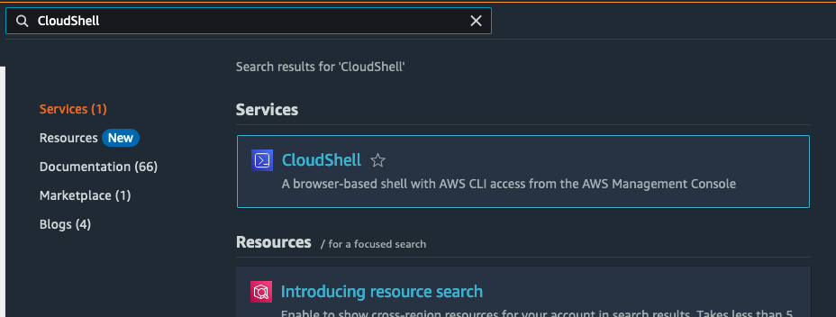

# 실습 사전 구성 가이드

이 문서는 실습 환경을 준비하는 과정을 단계별로 설명합니다.


## Step 1. 실습 계정 접속

1. **이메일 OTP 인증 선택**

   

2. **이메일로 전송된 Passcode 입력**

   

3. **AWS 콘솔 열기**

   좌측 하단의 **Open AWS console** 버튼을 클릭하여 실습 계정으로 이동합니다.

   


## Step 2. 실습 자원 배포

1. **Oregon (us-west-2) 리전**에서 실습 진행 여부를 확인합니다.

2. Console 하단 CloudShell 오픈


3. 아래 명령어 실행
```shell
git clone https://github.com/kevmyung/aws-kr-retail-cpg-genai.git
aws cloudformation create-stack --stack-name gen-ai-workshop --template-body file://aws-kr-retail-cpg-genai/genai-workshop.yaml --capabilities CAPABILITY_NAMED_IAM

```


## Step 3. 자원 배포 상태 확인
1. [CloudFormation 콘솔](https://us-west-2.console.aws.amazon.com/cloudformation)에서 자원 배포상태가 `CREATE_IN_PROGRESS`인지 확인합니다.

2. 자원 생성 완료까지 약 30분 소요됩니다.


## Step 4. Bedrock 초기 설정

1. [Bedrock 콘솔](https://us-west-2.console.aws.amazon.com/bedrock/home?region=us-west-2#/)로 이동합니다.

2. 좌측 탭 하단의 **Model access** 버튼을 클릭하거나, 이 [링크](https://us-west-2.console.aws.amazon.com/bedrock/home?region=us-west-2#/modelaccess)를 통해 이동합니다.

3. Amazon & Anthropic 모델 전체를 선택하고, 하단의 **Save changes** 버튼을 누릅니다.
   
   

4. 잠시 후 모델의 Access status가 `Access granted`로 변경됩니다.

실습 준비가 완료되었습니다. 진행자의 안내에 따라 실습을 진행해 주세요.
